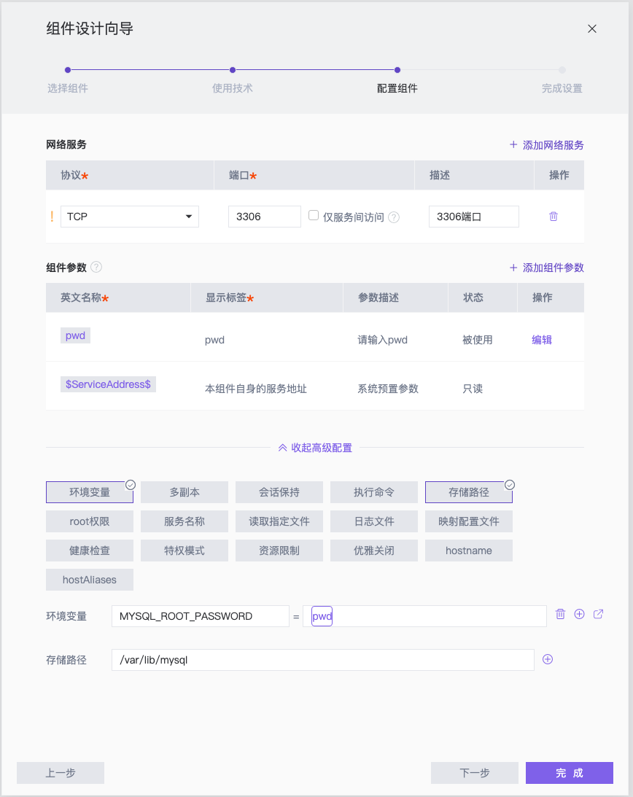

# StarOS 演示项目 - 数据库

该仓库为 [StarOS](http://staros.cloud) 的演示项目 **Wall** 中的数据库组件。

**Wall** 项目的其余组件为：
- 前端组件：[example-wall-web](https://github.com/StarOS-Cloud/example-wall-web)
- 后端组件：[example-wall-backend](https://github.com/StarOS-Cloud/example-wall-backend)

## 简介
该组件是基于 [Mysql:5.7](https://hub.docker.com/_/mysql) 开发的数据库，主要文件如下：

- `default.sql` 数据库建表文件。
- `custom.cnf` 数据库配置文件。

## 在 StarOS 中使用

### 技术栈
该仓库已内置 Dockerfile，使用 **Dockerfile in source** 技术栈即可。

### 组件配置
在 StarOS 中，该组件的配置方式如下：
1. 声明端口，MySQL 协议类型为`TCP`，端口为`3306`
2. 创建组件参数，用于传输密码至环境变量 `MYSQL_ROOT_PASSWORD`
3. 声明存储路径 `/var/lib/mysql`，用于将持久化数据挂载

可参考下图进行配置：



## 调试
### 构建

在命令行中键入如下命令，即可在本地构建镜像（需要先安装 Docker）。

``` shell
# 克隆代码
git clone https://github.com/StarOS-Cloud/example-wall-db.git
# 构建命令
docker build -t wall/mysql:latest ./example-wall-db
```

### 运行
在命令行中运行如下命令，即可运行：

``` shell
docker run -d -p 3306:3306 \
    --name wall-mysql \
    -e MYSQL_ROOT_PASSWORD=<PASSWORD> \
    -v <DATADIR>:/var/lib/mysql \
    wall/mysql
```

其中：
- `<PASSWORD>` 用于设置 `root` 账号的密码，如不设置，MySQL 将无法启动
- `<DATADIR>` 为本地环境的路径，用于持久化 Mysql 的数据，如仅用于调试，可忽略。

## 关于
[StarOS](http://staros.cloud) 是一款一站式云原生在线开发平台，致力于探索云原生应用的研发模式最佳实践。

如果您对我们感兴趣，或有任何问题或建议，欢迎随时联系我们：


邮箱：[hi@staros.cloud](mailto://hi@staros.cloud)
